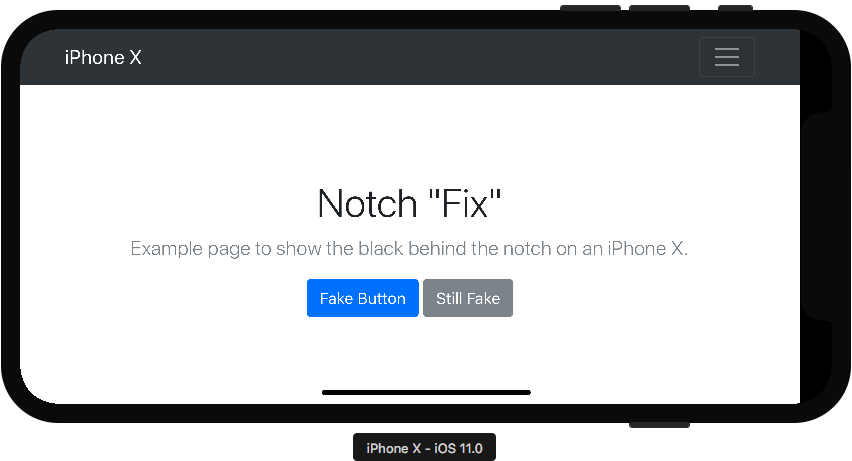

iPhone X "Fix"
===

Overview
---

This little project adds a black background behind the notch on the new **iPhone X** in **Landscape Mode**.  

Is this project meant to be the best solution? Nope.  This is just a partially thought out solution to a less thought out design decision.

This project specifically checks for the model of an **iPhone X** and looks for Orientation's that cause the screen to fall behind that weird little notch. Then CSS is applied to the `html` element and a pseudo `html::before` class is added to inject a black bar behind the notch.  More `html` element styling is applied to move the page over.

#### That's it :)


Screenshots
---

#### Animated Preview


#### No Notch Hidden


#### Left Notch Hidden


#### Right Notch Hidden




Installation
---

#### META Tag

You will need to make sure `viewport-fit=cover` is set via:

```html
<meta name="viewport" content="width=device-width, initial-scale=1.0, viewport-fit=cover">
```

#### CSS File

You will need to include either the [dist/iphone-x-fix.css](dist/iphone-x-fix.css) or [dist/iphone-x-fix.min.css]() file into your project.


#### JS File

You will need to include either the [dist/iphone-x-fix.js](dist/iphone-x-fix.js) or [dist/iphone-x-fix.min.js](dist/iphone-x-fix.min.js) file into your project.
